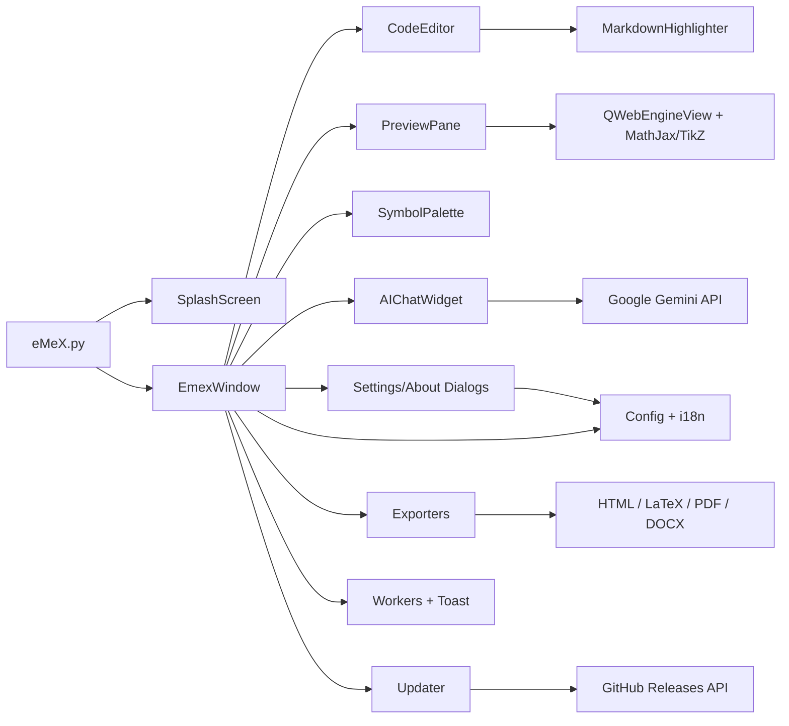

# eMeX

eMeX là trình soạn thảo Markdown cho tài liệu toán học, bài giảng và ghi chú kỹ thuật. Ứng dụng tập trung vào ba việc: viết Markdown nhanh, xem trước công thức/hình vẽ chính xác, và xuất bản tài liệu ra các định dạng phổ biến.

Mã nguồn và bản phát hành:

- Repository: <https://github.com/nhhai-math/eMeX.git>
- Releases: <https://github.com/nhhai-math/eMeX/releases>
- Latest release: <https://github.com/nhhai-math/eMeX/releases/latest>

## Tải phần mềm

Người dùng cuối tải bản mới nhất tại:

<https://github.com/nhhai-math/eMeX/releases/latest>

Link tải trực tiếp theo nền tảng:

- Windows x64: <https://github.com/nhhai-math/eMeX/releases/latest/download/emex-windows-x64.zip>
- macOS Intel: <https://github.com/nhhai-math/eMeX/releases/latest/download/emex-macos-intel.tar.gz>
- macOS Apple Silicon: <https://github.com/nhhai-math/eMeX/releases/latest/download/emex-macos-arm64.tar.gz>
- Linux x64: <https://github.com/nhhai-math/eMeX/releases/latest/download/emex-linux-x64.tar.gz>

## Tính năng hiện có

- Soạn thảo nhiều tab Markdown, khôi phục phiên làm việc và mở nhiều tệp từ dòng lệnh hoặc kéo-thả.
- Thanh công cụ icon-only cho các thao tác thường dùng: mở/lưu, định dạng Markdown, chèn liên kết/ảnh/bảng/code, tìm-thay, compile, hiển thị, cài đặt.
- Mẫu trang Markdown có sẵn và mẫu người dùng lưu từ trang hiện tại.
- Bảng ký hiệu và Markdown nhanh ở cột trái, có thể chỉnh kích thước nút trong Cài đặt.
- Syntax highlight, line number, snippet autocomplete, auto-pair và comment HTML bằng `Ctrl+/`.
- Preview Markdown bằng `QWebEngineView`, MathJax và TikZ; chế độ tự động chỉ render block đang soạn, `Ctrl+Enter` compile toàn tài liệu.
- Đồng bộ vị trí editor/preview bằng double-click hai chiều.
- Xuất HTML, LaTeX, PDF và DOCX. PDF được in từ preview đã render; DOCX hỗ trợ chuyển một số công thức LaTeX sang OMML.
- Trợ lý eMeX dùng Gemini, giao diện chat bubble, render Markdown, dán ảnh hoặc văn bản dài trực tiếp vào chat.
- Cấu hình Gemini API key, model, ngôn ngữ, font, autosave và kích thước UI trong Cài đặt.
- Hỗ trợ giao diện tiếng Việt/tiếng Anh qua `src/i18n.py`.
- Splash screen khi khởi động, toast notification không-modal và worker nền cho tác vụ nặng.
- Tự kiểm tra cập nhật từ GitHub Releases, tải đúng gói theo hệ điều hành và hỗ trợ cập nhật bản đóng gói.
- GitHub Actions build đa nền tảng và tạo Release tự động sau khi build thành công.

## Kiến trúc phần mềm



Luồng khởi động:

1. `eMeX.py` tạo `QApplication`, ép light theme, nạp icon và hiển thị splash.
2. `SplashScreen` hiển thị trạng thái khởi động và giữ tối thiểu một khoảng ngắn để tránh nhấp nháy UI.
3. `EmexWindow` dựng layout chính: cột trái, tab editor, preview, status bar, toolbar và các panel phụ.
4. Nếu có đường dẫn tệp trong argv, ứng dụng mở tất cả thành tab.
5. Sau khi UI sẵn sàng, splash đóng và cửa sổ chính mở maximized.

Luồng soạn thảo và preview:

1. Mỗi tab chứa một `CodeEditor`.
2. Khi nội dung thay đổi, `preview_timer` debounce rồi render block đang soạn.
3. Nếu block có TikZ hoặc nội dung cần render đầy đủ, người dùng dùng `Ctrl+Enter` hoặc nút `Compile`.
4. Preview gắn `data-source-line` vào các block HTML để hỗ trợ double-click đồng bộ về dòng nguồn.

Luồng xuất tài liệu:

1. Người dùng chọn định dạng trong menu `Xuất` ở toolbar preview.
2. HTML, LaTeX và DOCX chạy qua worker nền để không khóa giao diện.
3. PDF dùng preview hiện tại, chờ MathJax/TikZ render xong rồi gọi `printToPdf`.
4. Sau khi xuất thành công, eMeX lưu `last_export_path` để nút `Mở tệp vừa xuất` mở lại nhanh.

Luồng AI:

1. API key và model được cấu hình trong `Cài đặt > Gemini AI`.
2. `AIChatWidget` gom lịch sử chat, ảnh đính kèm, văn bản dán và gửi cho Gemini.
3. `GeminiWorker` chạy nền, dùng README làm ngữ cảnh ưu tiên để trợ lý trả lời theo đúng chức năng eMeX.
4. Phản hồi được render Markdown trong bubble. Trợ lý chỉ tập trung hỗ trợ cách dùng eMeX và soạn/chỉnh Markdown, MathJax, TikZ trong tài liệu eMeX.

Luồng cập nhật:

1. Sau khi mở app, `UpdateChecker` kiểm tra GitHub Releases.
2. Nếu có version mới hơn version đọc từ `VERSION` hoặc version trong bundle macOS, app hiển thị thông báo cập nhật.
3. `UpdateDialog` cho phép cập nhật ngay, nhắc lại sau hoặc bỏ qua phiên bản đó.
4. `UpdateDownloader` tải asset phù hợp: Windows zip, macOS tar.gz hoặc Linux tar.gz.
5. Bản đóng gói được thay thế bằng script cập nhật nền, sau đó app khởi động lại.

## Cấu trúc thư mục

```text
eMeX.py                         Entry point, QApplication, splash, mở nhiều file
VERSION                         Version runtime, lấy từ tag release khi build
build.spec                      PyInstaller spec cho Windows/macOS/Linux
requirements.txt                Runtime dependencies
README.md                       Tài liệu kiến trúc và hướng dẫn

src/
  main_window.py                Cửa sổ chính, tab, toolbar, export, session, update check
  editor.py                     Markdown editor, autocomplete, auto-pair, line number
  highlighter.py                Markdown syntax highlighter
  preview.py                    Markdown -> HTML, MathJax, TikZ, sync editor/preview
  exporters.py                  HTML, LaTeX, DOCX, helper cho PDF workflow
  ai_assistant.py               Chat Gemini, markdown bubble, image/text attachment
  symbol_palette.py             Bảng ký hiệu và Markdown nhanh
  dialogs.py                    Settings, About, model fetcher
  i18n.py                       Dịch runtime tiếng Việt/tiếng Anh
  splash.py                     Splash screen
  workers.py                    Worker nền và toast notification
  updater.py                    Kiểm tra/tải/cài bản cập nhật từ GitHub Releases
  update_dialog.py              Hộp thoại cập nhật

docs/assets/                    Icon PNG/ICO/ICNS
examples/document.md            Tài liệu mẫu Markdown
scripts/prepare_icons.py        Sinh ICO/ICNS từ PNG nguồn
scripts/install-linux-desktop.sh Tạo desktop entry cho Linux
.github/workflows/build.yml     Build đa nền tảng và Release tự động
```

## Cấu hình người dùng

eMeX lưu cấu hình cục bộ tại:

```text
~/.emex_editor/
```

Các file chính:

- `session.json`: phiên làm việc, danh sách tab và nội dung chưa lưu.
- `editor_config.json`: ngôn ngữ, font, wrap, line number, autosave, layout UI, model Gemini.
- `recent_files.json`: tệp gần đây.
- `ai_config.json`: Gemini API key.
- `user_snippets.json`: snippet người dùng.
- `page_templates.json`: mẫu trang do người dùng tạo.
- `update_skip.json`: phiên bản cập nhật đã chọn bỏ qua.
- `update.log` và `update-install.log`: log cập nhật.

Không commit các file cấu hình cá nhân này lên GitHub.

## Phím tắt chính

| Phím | Chức năng |
| --- | --- |
| `Ctrl+N` | Tạo trang mới hoặc chọn mẫu |
| `Ctrl+O` | Mở tệp Markdown |
| `Ctrl+S` | Lưu tab hiện tại |
| `Ctrl+Shift+S` | Lưu thành |
| `Ctrl+B` / `Ctrl+I` | In đậm / in nghiêng |
| `Ctrl+M` | Chèn toán inline |
| `Ctrl+Shift+M` | Chèn toán block |
| `Ctrl+T` | Chèn bảng |
| `Ctrl+/` | Bật/tắt comment HTML |
| `Ctrl+F` / `Ctrl+H` | Tìm / thay |
| `Ctrl+Enter` | Compile preview toàn tài liệu |
| `Ctrl+P` | Bật/tắt preview |
| `Ctrl+G` | Mở Trợ lý eMeX |
| `F11` | Chế độ tập trung |

## Chạy từ mã nguồn

Cài dependency:

```bash
python -m pip install -r requirements.txt
```

Chạy app:

```bash
python eMeX.py
```

Mở nhiều file:

```bash
python eMeX.py bai-1.md bai-2.md
```

## Build desktop local

```bash
python -m pip install -r requirements.txt pyinstaller pillow certifi
python scripts/prepare_icons.py
pyinstaller build.spec --noconfirm --clean
```

Kết quả Windows:

```text
dist/eMeX/eMeX.exe
```

Khi build release, `build.spec` bundle icon, PyQt6 WebEngine, certifi và dữ liệu runtime cần thiết.

## GitHub Actions và Releases

Workflow chính:

```text
.github/workflows/build.yml
```

Workflow chạy khi:

- Push lên `main`.
- Push tag dạng `vYYYY.MM.DD.xx`.
- Chạy thủ công bằng `workflow_dispatch`.

Artifact build:

- `emex-windows-x64.zip`
- `emex-macos-intel.tar.gz`
- `emex-macos-arm64.tar.gz`
- `emex-linux-x64.tar.gz`

Release tự động:

- Sau khi build cả 4 nền tảng thành công, job `release` tạo GitHub Release.
- Tag bắt buộc có dạng `vYYYY.MM.DD.xx`.
- `YYYY.MM.DD` theo ngày Việt Nam.
- `xx` là số thứ tự trong ngày, bắt đầu từ `01`.
- Nếu commit đã có tag hợp lệ, Release dùng tag đó.
- Nếu không có tag, workflow tự sinh tag kế tiếp theo ngày hiện tại.
- Nếu chạy thủ công và nhập `release_tag`, tag phải đúng định dạng.
- Trước khi PyInstaller build, workflow ghi `VERSION` bằng tag đã resolve sau khi bỏ chữ `v`.
- `VERSION` được bundle vào artifact để app, About dialog và updater nhận đúng version của bản phát hành.
- Nếu cùng một commit được push cả `main` và tag, run của `main` chỉ build; run của tag là nơi publish Release để tránh upload trùng.

Nếu release job báo lỗi quyền, kiểm tra GitHub repo:

```text
Settings > Actions > General > Workflow permissions > Read and write permissions
```

## Quy trình đẩy GitHub và phát hành

Remote chính:

```bash
git remote add origin https://github.com/nhhai-math/eMeX.git
```

Quy trình cập nhật bình thường:

```bash
git add .
git commit -m "Mô tả thay đổi"
git push origin main
```

Quy trình phát hành có tag thủ công:

```bash
echo YYYY.MM.DD.xx > VERSION
git add .
git commit -m "Mô tả thay đổi"
git tag vYYYY.MM.DD.xx
git push origin main vYYYY.MM.DD.xx
```

Ví dụ:

```bash
echo 2026.05.28.01 > VERSION
git add .
git commit -m "Phát hành v2026.05.28.01"
git tag v2026.05.28.01
git push origin main v2026.05.28.01
```

Sau khi push, GitHub Actions build lại và Release sẽ xuất hiện tại:

<https://github.com/nhhai-math/eMeX/releases>

## Ghi chú phát triển

- Không commit API key Gemini hoặc dữ liệu trong `~/.emex_editor`.
- Không commit `build/`, `dist/`, `upload-artifact/`, file cache Python hoặc file export tạm.
- Khi sửa preview, cần kiểm tra cả auto render block hiện tại và compile toàn tài liệu.
- Khi sửa export PDF, cần kiểm tra preview đã render MathJax/TikZ trước khi `printToPdf`.
- Khi sửa DOCX, chú ý parser OMML trong `src/exporters.py` và fallback readable text.
- Khi sửa AI, giữ ràng buộc trợ lý tập trung vào eMeX và dùng README làm ngữ cảnh.
- Khi sửa updater, kiểm tra đúng asset theo nền tảng và không chạy self-update khi đang chạy từ source.
