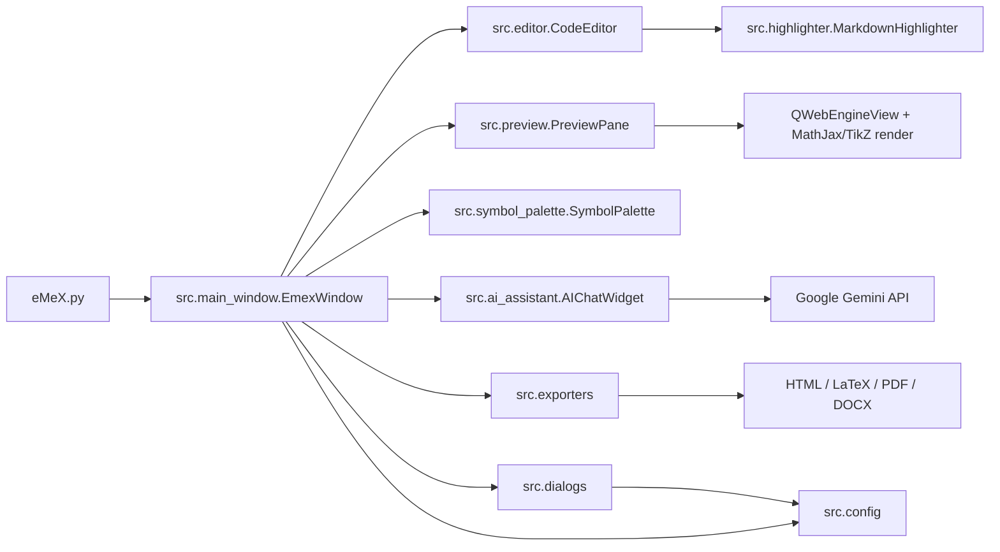

# eMeX

eMeX là trình soạn thảo Markdown cho tài liệu toán học, tập trung vào trải nghiệm viết nhanh, xem trước công thức/hình vẽ, xuất bản tài liệu và hỗ trợ AI trong quá trình soạn thảo.

Ứng dụng hiện được phát triển bằng Python + PyQt6, đóng gói đa nền tảng bằng PyInstaller và đồng bộ lên GitHub tại:

<https://github.com/nhhai-math/eMeX.git>

## Tải phần mềm

Người dùng cuối có thể tải bản phát hành mới nhất tại:

<https://github.com/nhhai-math/eMeX/releases/latest>

Link tải trực tiếp:

- Windows x64: <https://github.com/nhhai-math/eMeX/releases/latest/download/emex-windows-x64.zip>
- macOS Intel: <https://github.com/nhhai-math/eMeX/releases/latest/download/emex-macos-intel.tar.gz>
- macOS Apple Silicon: <https://github.com/nhhai-math/eMeX/releases/latest/download/emex-macos-arm64.tar.gz>
- Linux x64: <https://github.com/nhhai-math/eMeX/releases/latest/download/emex-linux-x64.tar.gz>

Các link trực tiếp sẽ hoạt động sau khi GitHub Actions tạo Release đầu tiên từ tag dạng `v*`.

## Chức năng chính

- Soạn thảo Markdown với syntax highlight, line number, snippet và bảng ký hiệu toán.
- Preview Markdown theo thời gian thực bằng MathJax, hỗ trợ TikZ block.
- Chế độ `Compile` để render lại toàn bộ tài liệu khi cần bản xem trước đầy đủ.
- Đồng bộ vị trí editor/preview bằng double-click hai chiều.
- Xuất tài liệu sang HTML, LaTeX, PDF và DOCX.
- Hộp chat AI hỗ trợ Gemini, có API key trong cửa sổ AI, chọn model, gửi ảnh dán trực tiếp và chèn/thay nội dung phản hồi vào tài liệu.
- Build tự động Windows, macOS Intel, macOS Apple Silicon và Linux bằng GitHub Actions.
- Tạo GitHub Releases tự động sau khi build thành công khi push tag dạng `v*`.

## Kiến trúc tổng quan



Luồng chính:

1. `eMeX.py` khởi tạo `QApplication`, thiết lập theme sáng, icon ứng dụng và mở `EmexWindow`.
2. `src/main_window.py` là shell chính: menu, toolbar, editor, preview, palette ký hiệu, panel AI, lưu phiên làm việc và điều phối lệnh.
3. `src/editor.py` cung cấp trình soạn thảo Markdown, snippet, auto-pair và line number.
4. `src/highlighter.py` tô màu cú pháp Markdown, công thức và code block.
5. `src/preview.py` chuyển Markdown sang HTML, render bằng `QWebEngineView`, MathJax và TikZ; hỗ trợ render đoạn đang soạn khi tự động và render toàn bộ khi `Compile`.
6. `src/exporters.py` chuyển Markdown sang HTML/LaTeX/DOCX và hỗ trợ luồng xuất PDF thông qua LaTeX.
7. `src/ai_assistant.py` quản lý chat AI, model Gemini, API key, ảnh dán vào chat và các thao tác chèn/thay phản hồi.
8. `src/config.py` chứa hằng số ứng dụng, cấu hình mặc định, snippet, danh sách model fallback, file session/recent/config trong thư mục người dùng.

## Cấu trúc thư mục

```text
eMeX.py                         Entry point desktop app
src/
  main_window.py                Cửa sổ chính, toolbar, layout, session
  editor.py                     Markdown editor
  highlighter.py                Syntax highlighting
  preview.py                    Markdown preview, MathJax, TikZ, sync vị trí
  exporters.py                  Export HTML, LaTeX, PDF, DOCX
  ai_assistant.py               Chat AI Gemini, model/API key/image paste
  symbol_palette.py             Bảng ký hiệu và Markdown nhanh
  dialogs.py                    About/settings dialog
  config.py                     Cấu hình, snippet, recent files, API key
docs/assets/                    Icon ứng dụng PNG/ICO/ICNS
scripts/
  prepare_icons.py              Sinh ICO/ICNS từ PNG nguồn
  install-linux-desktop.sh      Tạo desktop entry cho Linux build
.github/workflows/build.yml     Build đa nền tảng và release tự động
build.spec                      PyInstaller spec
requirements.txt                Runtime dependencies
```

## Cấu hình người dùng

eMeX lưu cấu hình cục bộ trong thư mục:

```text
~/.emex_editor/
```

Các file quan trọng:

- `session.json`: phiên làm việc gần nhất.
- `editor_config.json`: font, wrap, line number, model đang chọn.
- `recent_files.json`: danh sách file gần đây.
- `ai_config.json`: Gemini API key.

Các file này là dữ liệu máy cá nhân, không đưa lên GitHub.

## Chạy từ mã nguồn

Cài dependency:

```bash
python -m pip install -r requirements.txt
```

Chạy ứng dụng:

```bash
python eMeX.py
```

Mở kèm một file Markdown:

```bash
python eMeX.py path/to/document.md
```

## Build desktop

Build local bằng PyInstaller:

```bash
python -m pip install -r requirements.txt pyinstaller pillow certifi
python scripts/prepare_icons.py
pyinstaller build.spec --noconfirm --clean
```

Kết quả Windows local nằm ở:

```text
dist/eMeX/eMeX.exe
```

`build.spec` được thiết kế để bundle các phần cần thiết cho PyQt6 WebEngine, icon ứng dụng và dữ liệu runtime trong `docs/assets`.

## GitHub Actions

Workflow chính:

```text
.github/workflows/build.yml
```

Workflow chạy khi:

- Push lên nhánh `main`.
- Push tag dạng `v*`, ví dụ `v1.1.0`.
- Chạy thủ công bằng `workflow_dispatch`.

Các artifact được tạo:

- `emex-windows-x64.zip`
- `emex-macos-intel.tar.gz`
- `emex-macos-arm64.tar.gz`
- `emex-linux-x64.tar.gz`

## GitHub Releases tự động

Sau khi build cả 4 nền tảng thành công, job `release` sẽ tự tạo GitHub Release nếu:

- Commit được push bằng tag dạng `v*`, hoặc
- Workflow được chạy thủ công và có nhập `release_tag`.

Ví dụ phát hành bản mới:

```bash
git tag v1.1.0
git push origin v1.1.0
```

GitHub Actions sẽ build, kiểm tra artifact, sau đó tạo Release `eMeX v1.1.0` và đính kèm đủ 4 gói tải về.

Nếu chạy thủ công trong tab Actions, nhập:

```text
release_tag = v1.1.0
```

Workflow sẽ dùng tag đó để tạo Release sau khi build xong.

## Đẩy mã nguồn lên GitHub

Remote chính của dự án:

```bash
git remote add origin https://github.com/nhhai-math/eMeX.git
```

Quy trình cập nhật thông thường:

```bash
git add .
git commit -m "Mô tả thay đổi"
git push origin main
```

Nhánh chính:

```text
main
```

Commit đầu tiên đã được push lên GitHub, và các thay đổi tiếp theo nên đi theo cùng nhánh `main`. Build artifact, cache, file export và dữ liệu cấu hình cá nhân đã được loại khỏi Git bằng `.gitignore`.

## Ghi chú phát triển

- Không commit API key Gemini hoặc dữ liệu trong `~/.emex_editor`.
- Không commit thư mục `build/`, `dist/`, `upload-artifact/` hoặc file export sinh ra trong `examples/`.
- Khi thay đổi phần preview, cần chú ý `QWebEngineView`, MathJax và luồng render từng đoạn để tránh render lại toàn bộ tài liệu quá thường xuyên.
- Khi thay đổi AI chat, cần giữ nguyên luồng nhập ảnh, markdown message và thao tác chèn/thay nội dung phản hồi.
